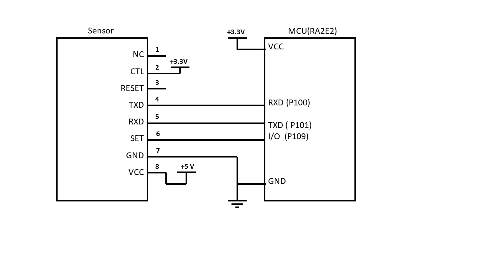
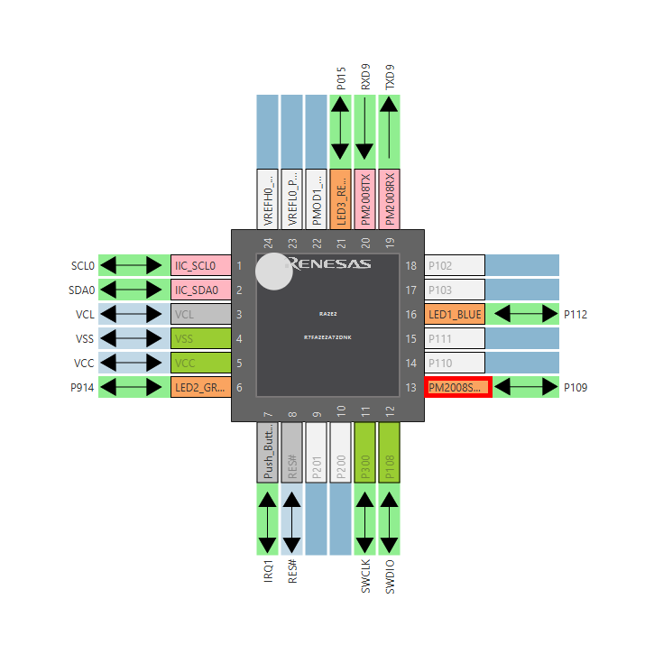
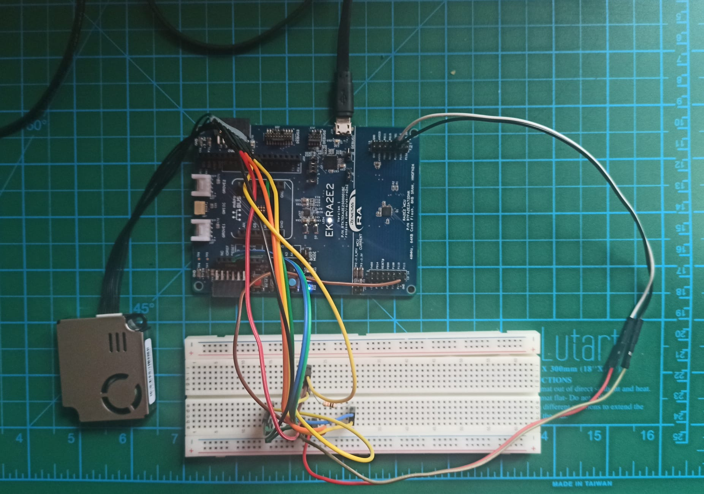
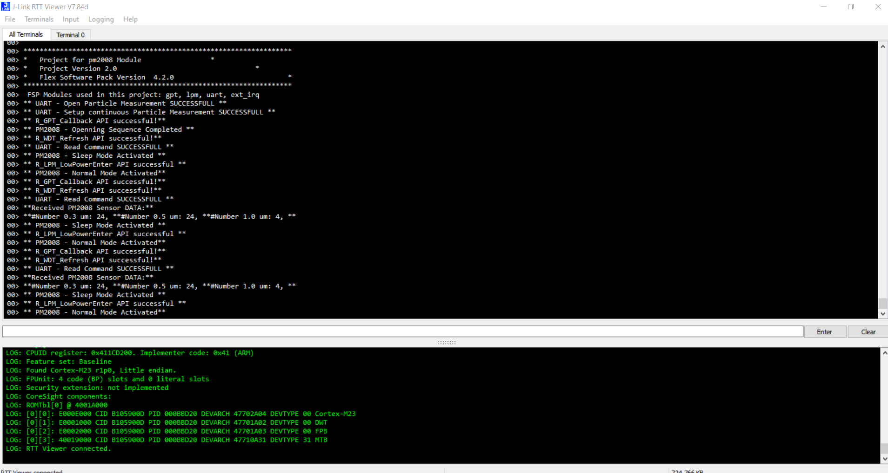

# Description
The objective of this project is to integrate PM 2008 sensor and Renesas development board for air quality monitoring and control system. The PM 2008 sensor is capable of measuring fine particulate matter (PM2.5) in the air, which has a significant impact on human health. The Renesas development board, on the other hand, provides a platform for rapid prototyping and testing of embedded systems.

The project will involve interfacing the PM 2008 sensor with the Renesas development board, which will allow the system to acquire real-time air quality data. This data will be processed and analyzed by the board, and relevant information will be displayed on an attached display. 

Overall, this project aims to provide a low-cost, yet reliable and efficient solution for monitoring air quality in various environments. It has applications in homes, offices, industrial settings, and public places, among others. The integration of PM 2008 sensor and Renesas development board provides a versatile and scalable platform for further development and integration with other systems.

# Summary of Tools
* Board:   EK-RA2E2 
* Device:   R7FA2E2A72DNK 
* Toolchain:   GCC ARM Embedded 
* Toolchain Version:   10.3.1.20210824 
* FSP Version:   4.2.0 https://github.com/renesas/fsp/releases/tag/v4.2.0
* IDE: e2tudio: https://www.renesas.com/eu/en/software-tool/e-studio
* Sensor: Cubic PM2008 - https://en.gassensor.com.cn/ParticulateMatterSensor/info_itemid_237.html

# Document List
## RA2E2 Related
 * [EK-RA2E2 v1-User's Manual](Documents/EK-RA2E2%20v1-User's%20Manual.pdf)
 * [EK-RA2E2-Quick Start Guide](Documents/EK-RA2E2-Quick%20Start%20Guide.pdf)
 * [RA2E2 Group Datasheet](Documents/RA2E2%20Group%20Datasheet.pdf)
 * [RA2E2 Group User's Manual Hardware](Documents/RA2E2%20Group%20User's%20Manual%20Hardware.pdf)
 * [Renesa v4.2.0 Software User's Manual](Documents/Renesas%20Flexible%20Software%20Package%20(FSP)%20v4.2.0%20User's%20Manual.pdf)
## PM 2008 Related
  * [PM2008M-M User Manual](Documents/PM2008M-M%20Laser%20Particle%20Sensor%20Module%20Specification.pdf)
 

# Setup
## Block Configuration of EK-RA2E2 and PM2008

## Pin Configuration

## Photo of EK-RA2E2 and PM2008 Connection

# Flow of Software
1. Initialize the MCU and necessary peripherals.
    1. initialization of timer(gpt) module
    2. initialization of external irq module
    3. initializaiton of watchdog timer module
    4. initialziation of low power module
    5. initialization of uart module
2. Start a timer with a defined interval in FSP configuration.
    1. This is a periodic timer triggering an interruprt.
3. Initialize PM2008 sensor.
    1. Open particule measurement
    2. Setup continuous particle measuring
4. Refresh watchdog timer
5. Communicate with PM2008 and read its data.
    1. Calculate CRC and Decode read message
    2. Visualize or indicate the sensor data to the user.
    3. Take action based on decoded message
6. Put the MCU and the sensor to sleep in order to save battery power.
    1. Low power module waits for
7. Wait for the timer interrupt and repeat the steps from Step 4.

# RTT Viewer Logs
SEGGER RTT tool is used in this project for monitoring. 
Note: SEGGER Real-Time Terminal (RTT) Viewer is a powerful tool for debugging embedded systems. It provides a convenient way to view and analyze real-time data from an embedded system, making it an essential tool for software engineers and developers. It can be used with a J-link Arm Debugger.

# Running Application Log

