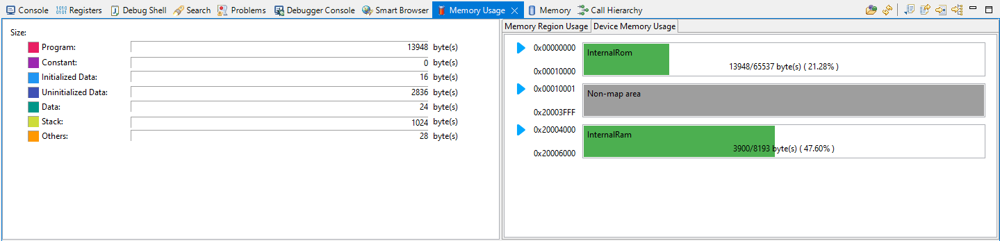

# Table of contents
1. [Introduction](#introduction)
     1. [PM2008](#pm2008-m)
     2. [Renesas MCU RA2E2](#renesas-mcu-ra2e2)
2. [Tools](#tools)
    1. [Hardware](#hardware)
    2. [Software](#software)
3. [Documents](#documents)
    1. [RA2E2](#ra2e2)
    2. [PM2008](#pm2008)
4. [Setup](#setup)
    1. [EK-RA2E2 and PM2008 - Block Configuration](#ek-ra2e2-and-pm2008---block-configuration )
    2. [R7FA2E2A7 Pin Configuration](#r7fa2e2a7-pin-configuration)
    3. [EK-RA2E2 and PM2008 - Application](#ek-ra2e2-and-pm2008---application)
5. [Software Documentation](#software-documentation)
    1. [Application Flow](#application-flow)
    2. [Memory Usage](#memory-usage)
7. [Validation](#validation)
   

# Introduction
The objective of this project is to integrate PM 2008 sensor and Renesas development board for air quality monitoring and control system. The PM 2008 sensor is capable of measuring fine particulate matter (PM2.5) in the air, which has a significant impact on human health. The Renesas development board, on the other hand, provides a platform for rapid prototyping and testing of embedded systems.

The project will involve interfacing the PM 2008 sensor with the Renesas development board, which will allow the system to acquire real-time air quality data. This data will be processed and analyzed by the board, and relevant information will be displayed on an attached display. 

Overall, this project aims to provide a low-cost, yet reliable and efficient solution for monitoring air quality in various environments. It has applications in homes, offices, industrial settings, and public places, among others. The integration of PM 2008 sensor and Renesas development board provides a versatile and scalable platform for further development and integration with other systems.

## PM2008-M
The PM2008 sensor is a type of air quality sensor that is designed to measure fine particulate matter (PM2.5) in the air. Several reasons why you this sensor has beed used:
* Health Impact: PM2.5 particles are small enough to enter the bloodstream through the lungs and have been linked to various health problems, such as heart disease, lung cancer, and respiratory problems. By measuring PM2.5 levels, the PM2008 sensor can provide important information about the air quality and its potential impact on human health.
* Easy to Use: The PM2008 sensor is simple to install and use, making it accessible for a wide range of applications, from homes and offices to public spaces and industrial settings.
* High Accuracy: The PM2008 sensor is designed to provide highly accurate and reliable PM2.5 measurements, allowing users to have confidence in the data they are receiving.
* Cost-Effective: Compared to other air quality sensors, the PM2008 is relatively low-cost, making it a cost-effective option for those who are looking to monitor air quality on a budget.

## Renesas MCU RA2E2
The RA2E2 Group is RA Family’s entry line single-chip microcontroller based on the 48-MHz Arm® Cortex®-M23 core with Renesas' innovative on-chip peripheral functions. RA2E2 Group offers ultra-low power operation and high speed serial communication with smallest package options of 20-pin and 24-pin QFN and 16-pin wafer-level CSP package, satisfying the needs of cost-sensitive and space-constrained applications. These RA2E2 Group microcontrollers enable extremely cost-effective designs for IoT sensor nodes, portable devices, industrial control, and any battery-operated application that requires developers to cut power consumption, cost and space.

This MCU group has been chosed cost-effective entry-line solution with low pin numbers. Part number **R7FA2E2A34CNJ** could be selected for this this application. as there is only 1 serial communication and several I/O's for input and output, 20 pin selection would be sufficient. Also [memory](#memory-usage) required for this application is 14kB (flash) and 4kB(ram), thus lowest code-flash(16 kb) option could be used. As this MCU is especially designed for low-power applications, this makes it a good candidate for this type of application with above mentioned facts.

# Tools
## Hardware
* Board:   EK-RA2E2 - MCU on Board: R7FA2E2A7
* Device:   R7FA2E2A72DNK 
* Sensor: Cubic PM2008 - https://en.gassensor.com.cn/ParticulateMatterSensor/info_itemid_237.html
## Software
* Toolchain:   GCC ARM Embedded 
* Toolchain Version:   10.3.1.20210824 
* FSP Version:   4.2.0 https://github.com/renesas/fsp/releases/tag/v4.2.0
* IDE: e2tudio: https://www.renesas.com/eu/en/software-tool/e-studio

# Documents
## RA2E2
 * [EK-RA2E2 v1-User's Manual](Documents/EKRA2E2_v1_UserManual.pdf)
 * [EK-RA2E2-Quick Start Guide](Documents/EK_RA2E2_Quick_Start_Guide.pdf)
 * [RA2E2 Group Datasheet](Documents/RA2E2_Group_Datasheet.pdf)
 * [RA2E2 Group User's Manual Hardware](Documents/RA2E2_Group_User_Manual_Hardware.pdf)
 * [Renesa v4.2.0 Software User's Manual](Documents/RA2E2_Software_User_Manual.pdf)
## PM2008
  * [PM2008M-M User Manual](Documents/PM2008M-UserManual.pdf)
 

# Setup
## EK-RA2E2 and PM2008 - Block Configuration

## R7FA2E2A7 Pin Configuration

## EK-RA2E2 and PM2008 - Application

# Software Documentation
## Application Flow
1. Initialize the MCU and necessary peripherals.
    1. initialization of timer(gpt) module
    2. initialization of external irq module.
    3. initializaiton of watchdog timer module
    4. initialziation of low power module
    5. initialization of uart module
2. Start a timer with a defined interval in FSP configuration.
    1. This is a periodic timer triggering an interruprt.
3. Initialize PM2008 sensor.
    1. Open particule measurement
    2. Setup continuous particle measuring
4. Refresh watchdog timer
5. Communicate with PM2008 and read its data.
    1. Calculate CRC and Decode read message
    2. Visualize or indicate the sensor data to the user.
    3. Take action based on decoded message
6. Put the MCU and the sensor to sleep in order to save battery power.
    1. Low power module waits for
7. Wait for the timer interrupt and repeat the steps from Step 4.
8. **[Optional]** Switch push button could be used to on/off opearition. However, this operation is constrained by watchdog timer.

## Memory Usage
After building the project below memory usage has been by e2Studio:

* Flash Usage: 14kB
* Ram Usage: 4kB 
* Note: There is room for improvement in terms of memory. As this is a prototype, optimzation levels are not used.

# Validation
## Segger RTT
SEGGER RTT tool is used in this validation, verification and monitoring. 
Note: SEGGER Real-Time Terminal (RTT) Viewer is a powerful tool for debugging embedded systems. It provides a convenient way to view and analyze real-time data from an embedded system, making it an essential tool for software engineers and developers. It can be used with a J-link Arm Debugger.
## Application Log

